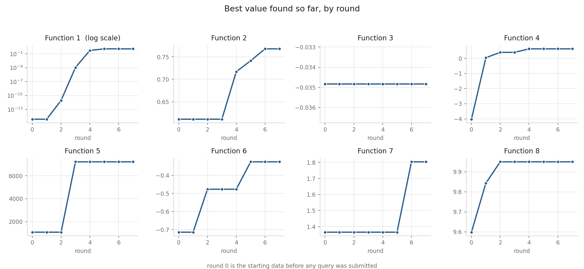

# Model Card

The model that chooses each week's queries for the black-box optimisation capstone.

## Model description

**Input:** a set of past readings for one function. Each reading is a point with between
2 and 8 coordinates, every coordinate between 0 and 1, paired with the single number the
function returned there. Between 17 and 47 readings per function at present.

**Output:** one new point to query next, in the same coordinate space. Not a prediction
of the function's value. The model's job is to decide where to look, not to say what is
there.

**Architecture:** Gaussian process regression with a Matern 5/2 kernel and a separate
length scale per input, fitted each round by maximising marginal likelihood with ten
restarts. A white noise term is added for Function 2 only, which the brief describes as
noisy. Function 5's outputs are log transformed first.

The next point is chosen by scoring 50,000 random candidates with an acquisition
function and taking the best. Which acquisition function is not fixed. Each round, every
function sits a leave-one-out test: drop a reading, refit, predict it, and compare the
error against simply predicting the average. Pass, and the function uses Expected
Improvement and chases the peak it believes in. Fail, and it uses Upper Confidence
Bound, which leans on uncertainty instead.

Function 1 does not use the Gaussian process at all. Its readings span about 120 orders
of magnitude and change sign, so in double precision the surface reads as flat and there
is no gradient to follow. It is handled by fitting a curve to the magnitude of the
readings and querying where that curve peaks.

## Performance

Measured as the best value found per function, against where each started.

| Function | Inputs | Readings | Best at start | Best now | Rounds since last gain |
|---|---|---|---|---|---|
| 1 | 2 | 17 | 7.711e-16 | 1.184 | 2 |
| 2 | 2 | 17 | 0.6112 | 0.7679 | 1 |
| 3 | 3 | 22 | -0.03484 | -0.03484 | 18 |
| 4 | 4 | 37 | -4.026 | 0.6312 | 3 |
| 5 | 4 | 27 | 1089 | 7216 | 4 |
| 6 | 5 | 27 | -0.7143 | -0.3246 | 2 |
| 7 | 6 | 37 | 1.365 | 1.804 | 1 |
| 8 | 8 | 47 | 9.598 | 9.95 | 5 |

Seven rounds submitted. Six of the eight functions have improved on their starting best.
Function 1 has moved furthest, about fifteen orders of magnitude, and every step of that
came from replacing the model rather than adding data.

A second measure matters as much: whether the model's prediction matched the result.
After Round 1, six of eight results fell outside the model's own confidence band, which
is what prompted the leave-one-out test. By Round 5 the Function 1 curve predicted log10
of the size at +0.06 and the reading came back at +0.073.

## Limitations

**Function 3 has not improved in eighteen rounds.** Its best reading is still the fourth
one ever taken, and it has failed the leave-one-out test every single week. The most
likely explanation is that a stationary kernel, which assumes the same smoothness
everywhere, cannot represent it.

**More data does not always help.** Function 4's leave-one-out error rose from 1.19 at
31 readings to 4.74 at 37. Its newer readings come from regions the kernel cannot
reconcile with the rest, so fitting them degrades the fit everywhere. Function 8 improved
over the same growth, from 0.138 to 0.093.

**Sample size is the binding constraint.** Between 17 and 47 readings for up to 8
dimensions. Nearly every reading is a support vector when an SVM is fitted, meaning
nothing sits comfortably away from any boundary.

**The model is confident where it should not be.** It has twice sent a query somewhere
it had never measured and been wrong by more than ten orders of magnitude.

## Trade-offs

**Exploiting requires an honest model, and mine has not always been.** The leave-one-out
test exists because of this, but it is a coarse gate. It compares against a mean
predictor, which on a badly behaved function is a low bar to clear.

**No trust region.** The model proposes points anywhere in the space, including far from
anything measured. Function 4's swings between 0.63, -7.35 and -0.12 are the cost.

**Interpretability was chosen over flexibility.** Linear regression, SVMs and a small
neural network were all tested and none replaced the Gaussian process, because none of
them reports uncertainty and uncertainty is the entire input to the acquisition
function. The network in particular gave no usable decision boundary: not one observed
point came back with a predicted probability near 0.5.

**One query per function per week.** Every choice costs a week, so a wasted query cannot
be recovered by running more of them. This rules out grid search and any method needing
a validation budget.
