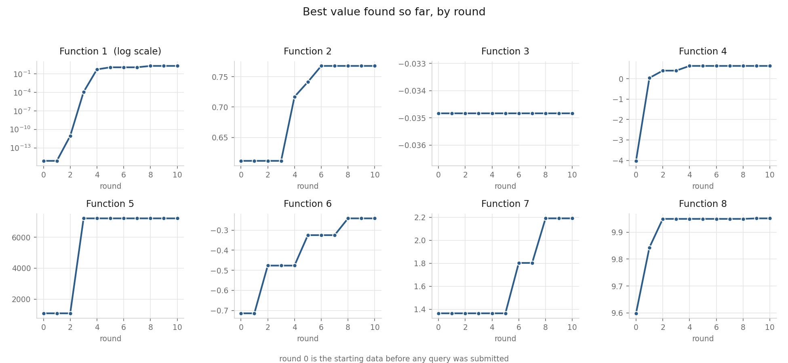

# Model Card

The model that chooses each week's queries for the black-box optimisation capstone.

## Overview

- Name: per-function Gaussian Process with a measured acquisition switch.
- The system uses a Gaussian Process for most functions.
- A leave-one-out check decides which acquisition method to use.
- The system is part of a Bayesian optimisation process.
- Its job is to choose the next point to test, not to predict an exact result.
- Current version: Version 4, used for round 10, my last submitted round.
- Input: previous readings for one function.
- Output: one new point to query.

## Intended use

- The system is useful when evaluations are limited or expensive.
- It should not be used to predict an exact result. For example, Function 4 has a leave-one-out error of about 5, while its readings cover a range of about 10.
- It should not be used when direct testing is cheap.
- It should not be trusted far from areas that have already been measured.

## Details

How it works:

- Most functions use a Gaussian Process with a Matérn 5/2 kernel.
- Each input has its own length scale.
- Function 2 also includes a white-noise term.
- The code generates 50,000 possible points.
- It scores each point using an acquisition function.
- It selects the highest-scoring point.

### Leave-one-out check

For each function, the code:

- Removes one reading.
- Refits the Gaussian Process.
- Predicts the missing result.
- Compares the error with simply predicting the average.

The result decides the acquisition method:

- Pass: use Expected Improvement.
- Fail: use Upper Confidence Bound.

### How the system changed across rounds

- Round 1: all eight functions used Expected Improvement. Six results fell outside the Gaussian Process confidence bands.
- Round 2: I added the leave-one-out check, and replaced the Gaussian Process for Function 1 with a curve-fitting method.
- Round 8: I stopped Function 1 from searching beyond its existing readings. This followed the Round 7 result that fell by thirteen orders of magnitude.
- Round 9: I added a limited search area for Function 4. It shrinks after each round that fails to improve: 0.15, then 0.10, with 0.07 planned next.
- Rounds 11 to 13 (planned, not submitted because of time): Function 1 fits one quadratic surface through the readings near its peak, instead of two separate lines. Rounds 12 and 13 were due on the same day as round 11, so they were planned to treat the model's prediction for the round before as the result, and no two rounds can land within 0.05 of each other.

## Performance

Ten rounds of results. I measure performance using:

- The best result found for each function.
- Whether the predicted result was close to the actual result.

| Function | Inputs | Readings | Best at start | Best now | Rounds since last gain | Leave-one-out error |
|---|---|---|---|---|---|---|
| 1 | 2 | 20 | 7.711e-16 | 1.985 | 2 | not applicable |
| 2 | 2 | 20 | 0.6112 | 0.7679 | 4 | 0.218 |
| 3 | 3 | 25 | -0.03484 | -0.03484 | 10 | 0.076 |
| 4 | 4 | 40 | -4.026 | 0.6312 | 6 | 4.585 |
| 5 | 4 | 30 | 1089 | 7216 | 7 | 1.993 |
| 6 | 5 | 30 | -0.7143 | -0.2411 | 2 | 0.255 |
| 7 | 6 | 40 | 1.365 | 2.191 | 2 | 0.322 |
| 8 | 8 | 50 | 9.598 | 9.952 | 1 | 0.049 |

- Six of the eight functions have improved on their starting best.
- Function 1 improved the most, by about fifteen orders of magnitude.
- That improvement came from changing the modelling method, not simply adding more data.
- The number of functions improving in each round was 2, 4, 2, 3, 3, 2, 0, 3, 1 and 0.
- Progress is slowing.

## Assumptions and limitations

- The Gaussian Process assumes each function is equally smooth across its search space.
- Function 3 may break this assumption. It has not improved in ten rounds.
- More data has not always improved the model. Function 4's leave-one-out error increased from about 1.2 with 31 readings to about 5 with 39.
- I receive only one query per function each round.
- A wasted query cannot be recovered by running another one.
- The main risk is confident extrapolation. The model may recommend a point far from existing readings, and may report more confidence than the available data supports.

## Ethical considerations

Reproducibility, and use of LLMs.

- Each round has its own saved version of the code and data.
- This allows any round to be rerun using only the information available at that time.
- A notebook can remove the latest reading, rerun the leave-one-out check, regenerate the queries, and confirm that they match the submitted file.
- Every change to the system followed a recorded prediction that did not match the actual result.
- For example, the Round 7 failure showed why Function 1 should no longer extrapolate beyond its existing readings.

I used ChatGPT 5.5, ChatGPT 5.6 Sol, ChatGPT 6 Sol, ChatGPT 6 Astra, Claude Opus 5 and Claude Opus 5.5 over the course of the project to:

- Discuss and analyse the weekly output results.
- Help write Python code, and debugging.
- Explain concepts I had not met before, in simplified terms.
- Brainstorm, structure and format.
- Turn my decisions, methodology, results, drafts and written reflections into concise documentation.
- Improve the clarity and comprehension of my writing.

I made the final decisions about which queries to submit. Suggestions from an LLM were not accepted unless I could check them using my own data and code.

## Trade-offs

- Exploiting requires an honest model, and mine has not always been. The leave-one-out check exists because of this, but it is a coarse gate.
- Interpretability over flexibility. Linear regression, SVMs and a small neural network were all tested and none replaced the Gaussian Process, because none reports uncertainty, and uncertainty is the entire input to the acquisition function.
- Robustness over peak performance, latterly. The trust region on Function 4 has not raised its best value, which is still 0.63, but it cut the worst case from -8.85 to -1.26. With few rounds left, a bounded loss is worth more than an unlikely gain.
